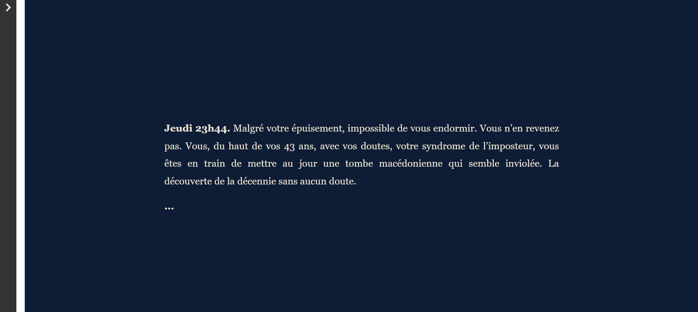

# Le mystère de la tombe macédonienne

Il s'agit d'une fiction interactive développée dans le cadre du cours Fiction interactive dispensé par Isaac Pante, UNIL. 

## Synopsis

Cette fiction propose d'entrer dans la peau d'un archéologue au moment de la découverte d'une riche tombe macédonienne en Grèce du Nord. Vous devrez alors trouver un moyen de calmer les ardeurs de votre collègue qui est persuadé qu'il s'agit de la tombe d'Alexandre Le Grand, alors même que les sources antiques relatent qu'elle se trouve à Alexandrie.

## Technologie

La fiction a été développée à l'aide de l'outil Twine.

## Crédits

La fiction est agrémentée de quelques bruitages ambiants, dont voici les crédits :

- La sonothèque : https://lasonotheque.org/
- Soundsnap : https://www.soundsnap.com/
- fesliyanStudios : https://www.fesliyanstudios.com/
- Sound-fishing : https://www.sound-fishing.net/
